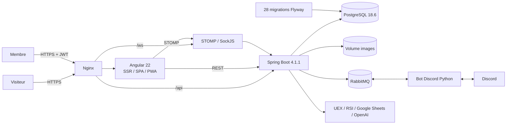
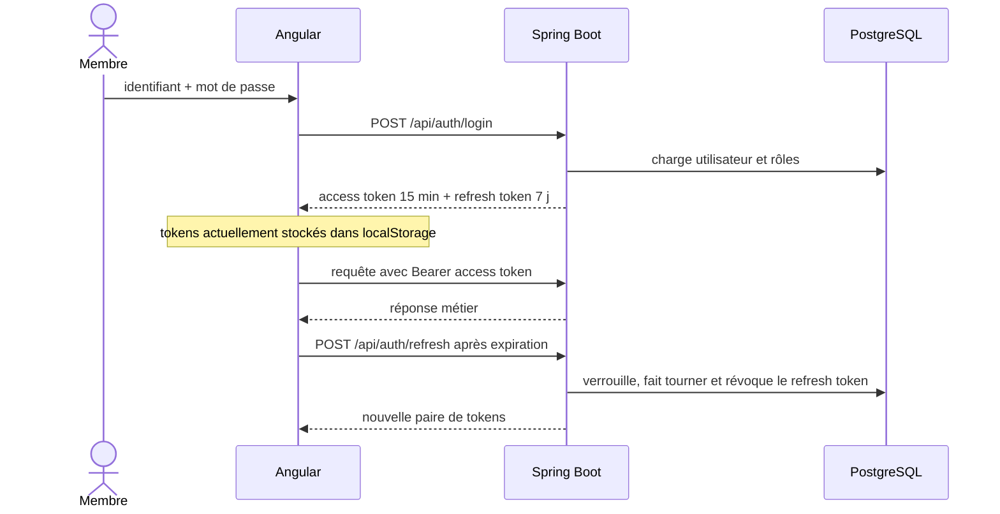
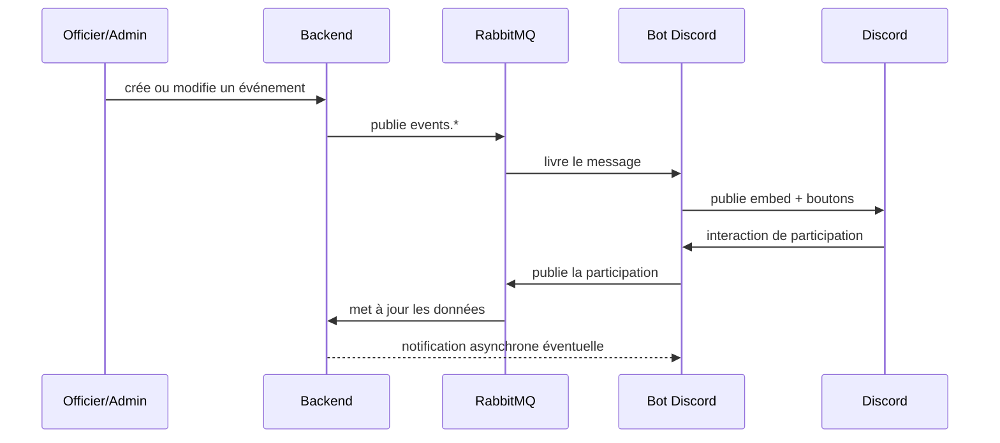
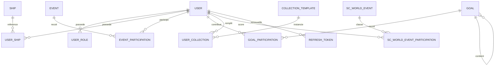
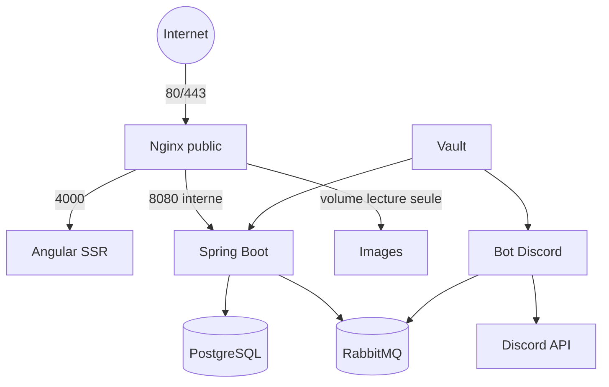

# Architecture IceForge

## Vue d'ensemble

IceForge combine un site public Star Citizen, un espace membre, une administration et un bot Discord. Le backend reste le propriétaire des données métier ; le bot sert principalement de passerelle communautaire.



## Composants

| Composant | Chemin | Responsabilités principales |
|---|---|---|
| Frontend | [`icy-angular/`](../icy-angular/) | pages publiques, espace membre, administration, REST, WebSocket, SEO, PWA |
| Backend | [`icy_backend/`](../icy_backend/) | authentification, utilisateurs, événements, objectifs, collections, catalogues, images, notifications, intégrations |
| Bot | [`icy/`](../icy/) | messages Discord, boutons de participation, commandes, consommation/publication RabbitMQ |
| Déploiement principal | [`docker-compose.yml`](../docker-compose.yml) | PostgreSQL, backend, frontend statique, bot, images et RabbitMQ |
| Déploiement SSR | [`icy-angular/docker-compose.ssr.yml`](../icy-angular/docker-compose.ssr.yml) | serveur Node Angular SSR derrière Nginx |
| Vault local | [`docker-compose.vault.yml`](../docker-compose.vault.yml) | Vault de développement |

## Flux de connexion



Le backend distingue les tokens `access`, `refresh` et `password_reset`. Les refresh tokens sont hachés en base et tournés à chaque usage. Le point faible côté navigateur est le stockage dans `localStorage`, qui augmente l'impact d'une XSS ; la cible recommandée est un refresh token en cookie `HttpOnly`, `Secure`, `SameSite`, avec access token court gardé en mémoire.

## Flux événement et Discord



Ce flux doit être rendu idempotent. Dans l'état audité, le bot acquitte certains messages même quand leur traitement échoue et peut annoncer un succès avant confirmation de publication.

## Domaines de données



Autres domaines : recrutement, actualités et types, images et tags, fiches de minage, Wikelo, UEX, corps célestes, stations, minerais, objets et configuration des hangars exécutifs.

## Déploiement et frontières réseau



La cible de production doit uniquement exposer 80/443. PostgreSQL 5432, backend 8080, bot 8090, serveur d'images 8081, AMQP 5672, management RabbitMQ 15672 et Vault 8200 doivent rester privés ou liés à `127.0.0.1` selon le besoin d'administration.

### Incohérence actuelle

Le compose principal lance un Nginx statique et monte `./frontend`, qui ne contient dans le dépôt que des images. Le Dockerfile Angular sait construire une SPA et le compose SSR sait lancer le serveur Node, mais ces chemins ne forment pas aujourd'hui un déploiement unique reproductible. La production observée le 24 août 2026 sert encore un build statique du 11 juin 2026.

La cible recommandée est :

1. construire `icy-angular/Dockerfile.ssr` ;
2. servir toutes les routes publiques indexables via Angular SSR ou prérendu ;
3. servir `/icy/**` côté client uniquement ;
4. router `/api/**`, `/ws/**` et `/images/**` par le même Nginx ;
5. supprimer le frontend statique historique et le port bot inutilisé.

## Configuration et secrets

Les secrets doivent provenir de Vault, de secrets Docker ou de l'environnement sans valeur de repli exploitable :

- `JWT_SECRET` ;
- `BOT_API_KEY` ;
- `DISCORD_TOKEN` ;
- identifiants PostgreSQL et RabbitMQ ;
- clés VAPID ;
- clés UEX et OpenAI ;
- AppRole Vault.

Ne jamais journaliser une URL contenant des identifiants. Un démarrage de production doit échouer si un secret est vide, faible ou égal à un placeholder.

## Commandes de vérification

```powershell
# Backend
cd icy_backend
.\mvnw.cmd test

# Frontend : compile sans modifier sitemap/version
cd ..\icy-angular
npx ng build --configuration production
npx ng test --watch=false --browsers=ChromeHeadless

# Bot : installer puis lancer dans un environnement configuré
cd ..\icy
python -m pip install -r requirements.lock
python bot.py

# Configuration Docker
cd ..
docker compose config --quiet
```

Le bot ne doit pas être importé comme simple test : son module charge la configuration et peut ouvrir des connexions. Utiliser de vrais tests avec clients Discord, HTTP et AMQP simulés.
