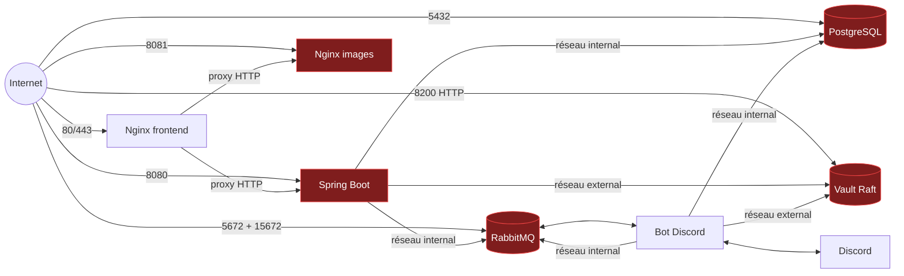

# Architecture et audit de production

Date de l'observation : **24 août 2026**

Méthode : inventaire SSH et tests HTTP/TCP externes, strictement en lecture
seule. Aucun conteneur, fichier, règle réseau, secret ou volume n'a été modifié.
L'adresse de l'hôte, les identifiants, les chemins de secrets et les identifiants
Vault sont volontairement absents de ce document.

## Conclusion

L'application fonctionne et l'hôte possède beaucoup de marge, mais la priorité
n'est plus une montée de version : il faut d'abord réduire la surface réseau et
créer des sauvegardes restaurables.

PostgreSQL, RabbitMQ, son interface d'administration et Vault sont réellement
joignables depuis Internet en clair. Le pare-feu de l'hôte est inactif, SELinux
est désactivé et SSH autorise root par mot de passe. Docker documente qu'un port
publié sans adresse explicite est lié à toutes les adresses de l'hôte et devient
accessible à l'extérieur : [publication des ports](https://docs.docker.com/engine/network/port-publishing/)
et [interaction avec les pare-feu](https://docs.docker.com/engine/network/packet-filtering-firewalls/).

Ce constat est classé **P0**. Aucune migration PostgreSQL, RabbitMQ ou Vault ne
doit commencer avant le cloisonnement, les sauvegardes et un test de restauration.

## Topologie observée

Le réseau Docker `iceforge_internal` porte bien l'option `internal: true`, mais
PostgreSQL et RabbitMQ sont simultanément raccordés au réseau
`iceforge_external` et publiés sur l'hôte. Vault est uniquement sur le réseau
externe. Le cloisonnement prévu par le dépôt modernisé n'est donc pas celui qui
est actuellement déployé.

## Surface externe confirmée

| Port | Service | Résultat externe | Cible |
|---:|---|---|---|
| 22 | SSH | accessible | clé uniquement, adresse d'administration restreinte |
| 80/443 | site public | accessible, attendu | conserver |
| 111 | rpcbind | accessible | fermer si aucun montage RPC/NFS ne le justifie |
| 5432 | PostgreSQL | accessible | supprimer la publication |
| 5672 | AMQP | accessible sans TLS | supprimer la publication |
| 15672 | RabbitMQ Management | page de connexion HTTP 200 | tunnel SSH/VPN uniquement |
| 8080 | backend | accessible ; Actuator, OpenAPI et Swagger répondent 403 | accès par Nginx uniquement |
| 8081 | Nginx images | accessible | accès par Nginx uniquement |
| 8090 | API bot | publiée par Docker mais filtrée en amont | supprimer malgré le filtrage |
| 8200 | Vault | API de santé HTTP 200 | réseau privé et TLS obligatoires |

Le 403 observé sur les points sensibles du backend est positif, mais il ne
justifie pas l'exposition directe de l'ensemble de l'API.

## Hôte et moteur de conteneurs

| Élément | Production observée | Évaluation |
|---|---|---|
| OS | AlmaLinux 9.5, noyau `5.14.0-503.23.2.el9_5` | ancien ; le cache annonce de nombreux correctifs de sécurité |
| Capacité | 4 vCPU, 15 Gio RAM, 199 Gio disque dont 4 % utilisés | marge confortable |
| Uptime | 105 jours | planifier correctifs et redémarrage contrôlé |
| Swap | désactivé | favorable à Vault |
| Docker | Engine 28.0.1, Compose 2.33.1, containerd 1.7.25 | mise à jour dédiée après sauvegardes |
| Journalisation | `json-file`, 10 Mio × 3 fichiers | rotation correcte |
| Live restore | désactivé | un redémarrage Docker arrête les conteneurs |
| Pare-feu | firewalld absent/inactif | P0 |
| SELinux | désactivé | réactivation progressive, pas en urgence aveugle |
| SSH | root et mots de passe autorisés, X11 et forwarding activés | P0/P1 |

AlmaLinux 9.8 est disponible avec un noyau plus récent ; la montée de l'hôte
doit rester séparée des changements applicatifs :
[notes AlmaLinux 9.8](https://wiki.almalinux.org/release-notes/9.8).

## Versions réellement exécutées

| Composant | Production | Cible déjà validée dans le dépôt |
|---|---|---|
| Frontend | Angular 19.1 / TypeScript 5.7, build statique ; Nginx 1.27.5 | Angular 22.1 / TypeScript 6.0 ; Nginx 1.30.4 épinglé |
| Backend | Java 21.0.11 / Spring Boot 3.4.2 | Java 25.0.4 / Spring Boot 4.1.1 |
| Bot | Python 3.11.14 / discord.py 2.3.2 / aio-pika 9.6.1 / FastAPI 0.110.0 | Python 3.14.7 / discord.py 2.7.1 / aio-pika 10.0.1 / FastAPI 0.141.1 |
| PostgreSQL | 15.13, Debian 12, locale `en_US.utf8` | 18.6 Bookworm, même locale |
| RabbitMQ | 3.13.7 / Erlang 26.2.5.15 | 4.3.5 / Erlang 27.3, en deux paliers |
| Vault | 1.17.6 Community, Raft | Vault 2.x Community corrigée après répétition |
| Serveur d'images | Nginx 1.29.2 via tag flottant `latest` | Nginx 1.30.4 épinglé |

Les images publiques de production sont référencées par tags flottants dans le
Compose, même si Docker conserve localement leurs digests. Les images backend et
bot ne portent ni digest de registre ni SHA Git. Le dossier déployé ne contient
aucune métadonnée Git et les deux fichiers Compose diffèrent de ceux du dépôt
modernisé. Un rollback applicatif reproductible n'est donc pas garanti avant
l'archivage des images actuelles et de leur configuration sanitisée.

## Données, sauvegardes et retour arrière

### PostgreSQL

- base active d'environ 15 Mio ; volume d'environ 70 Mio ;
- `pgcrypto` est la seule extension applicative ;
- encodage UTF-8 et collations `en_US.utf8`, ce qui confirme le choix de
  PostgreSQL 18 **Bookworm** plutôt qu'Alpine ;
- `archive_mode=off`, aucune réplication et aucun PITR ;
- aucun job de sauvegarde local observé ; deux dumps SQL datent du 2 mars 2026.

Il faut produire un dump `pg_dump -Fc`, les objets globaux, le checksum et une
copie chiffrée hors hôte, puis restaurer réellement le tout dans PostgreSQL 18
isolé. PostgreSQL recommande des sauvegardes régulières et distingue dump SQL,
sauvegarde physique et archivage continu :
[documentation officielle](https://www.postgresql.org/docs/18/backup.html).

### RabbitMQ

- nœud unique, sept files classic durables, aucun message en attente lors de
  l'observation ;
- toutes les feature flags stables de 3.13 sont actives ; Khepri est désactivé ;
- données dans un **volume Docker anonyme** d'environ 284 Kio ;
- aucune exportation de définitions ou sauvegarde du volume observée.

Avant toute recréation, nommer explicitement le volume, exporter les définitions
et tester une restauration avec le même nom de nœud. RabbitMQ précise que les
messages ne doivent pas être copiés à chaud et que la restauration sur disque
exige le même nom de nœud :
[Backup and Restore](https://www.rabbitmq.com/docs/backup).

### Vault

- Vault Community 1.17.6, actif et non scellé ;
- un seul nœud Raft, stockage d'environ 99 Mio ;
- initialisation Shamir avec une seule part et un seuil de une (`1/1`) ;
- listener API avec `tls_disable=1`, publié sur Internet ;
- aucun snapshot Raft local observé ; les sauvegardes éventuelles de l'hébergeur
  restent à confirmer.

HashiCorp indique que Vault doit toujours utiliser TLS en production et que les
snapshots Raft doivent être conservés de façon sûre hors du stockage du cluster :
[TLS et Raft](https://developer.hashicorp.com/vault/tutorials/raft/raft-storage)
et [gestion des snapshots](https://developer.hashicorp.com/vault/docs/sysadmin/snapshots).

La migration 1.17.6 vers 2.0.4 et son rollback ont réussi localement sur données
synthétiques, mais 2.0.4 reste NO-GO tant que l'image Community conserve des
vulnérabilités Go corrigibles. Le palier Community 1.21.4 a aussi été évalué et
rejeté : son image contient encore cinq vulnérabilités critiques et davantage de
vulnérabilités corrigibles que 2.0.4. Le cloisonnement et les snapshots de 1.17.6
sont donc prioritaires en attendant une image 2.x corrigée.

### Images et configuration

- volume d'images : environ 15 Mio ; aucune sauvegarde locale observée ;
- fichiers d'environnement en mode `0644`, atténué par un répertoire `/root` en
  `0550`, mais `0600` reste la cible ;
- configuration, certificats, scripts de déploiement et images applicatives
  doivent rejoindre le plan de sauvegarde, sans exporter de secret en clair.

L'absence de sauvegarde locale visible ne prouve pas l'absence de snapshot chez
l'hébergeur. La fréquence, la rétention et surtout un test de restauration
Hostinger doivent être confirmés avant toute opération.

## Durcissement des conteneurs

Les sept services actifs n'ont ni healthcheck Docker, ni limite CPU/mémoire/PID,
ni système de fichiers racine en lecture seule, ni `no-new-privileges`, ni retrait
de capacités. Backend, bot, Nginx, RabbitMQ et Vault démarrent en root. Aucun
redémarrage ou OOM n'a toutefois été observé depuis leur dernier démarrage.

Le fichier `docker-compose.prod.yml` du dépôt modernisé couvre déjà une grande
partie de ces écarts. Il ne doit pas être appliqué directement à l'ancienne pile :
les versions, noms de volumes et formats de données ont changé. Chaque service
doit être promu séparément après sauvegarde et smoke test.

## Bordure HTTP

- le certificat ECDSA `iceforge.fr` est valide jusqu'au 26 octobre 2026 et le
  timer Certbot est actif ;
- le site redirige HTTP vers HTTPS ;
- Nginx révèle sa version ;
- aucun HSTS, CSP, `X-Content-Type-Options`, `Referrer-Policy` ou
  `Permissions-Policy` n'est présent sur la page d'accueil ;
- Vault envoie un HSTS sur une connexion HTTP, ce qui ne chiffre pas la requête ;
- RabbitMQ Management est servi en HTTP clair.

Les en-têtes du site et `server_tokens off` peuvent être livrés avec le prochain
déploiement Nginx stateless, après validation de la CSP sur les ressources
externes du frontend.

## Plan de bataille production

Chaque ligne correspond à une branche ou une intervention indépendante. Une
étape ne commence que lorsque le rollback de la précédente a été testé.

| Ordre | Branche/intervention | Changement | Preuve avant promotion | Rollback |
|---:|---|---|---|---|
| 0 | pare-feu hébergeur | n'autoriser publiquement que 80/443 et SSH restreint ; fermer 111, 5432, 5672, 15672, 8080, 8081, 8090, 8200 | test externe + connexions internes | réouvrir uniquement le port client identifié |
| 1 | `codex/prod-backups` | scripts et procédure PG, RabbitMQ, Vault, images/config | restaurations isolées + checksums | conserver les sources intactes |
| 2 | `codex/prod-network-lockdown` | retirer les publications Compose internes, placer Vault sur le réseau privé | pile clone, API via Nginx, DB/MQ/Vault depuis les clients | ancien Compose archivé + règle temporaire réversible |
| 3 | `codex/prod-ssh-hardening` | clé uniquement, root sans mot de passe, compte admin nominatif, fermer rpcbind | seconde session SSH ouverte avant de fermer la première | restauration config + reload SSH validé |
| 4 | `codex/prod-host-almalinux-9-8` | correctifs AlmaLinux/Docker, redémarrage | snapshot hébergeur, maintenance, santé complète | snapshot ou versions RPM conservées |
| 5 | branches frontend/backend/bot | promouvoir séparément les images déjà validées | smoke API, auth, WebSocket, Discord et logs | anciennes images archivées par ID/digest |
| 6 | branches RabbitMQ | 3.13→4.2→4.3 avec même nom de nœud | définitions, sentinelles persistantes, deux clients | restauration du volume de chaque palier |
| 7 | `codex/upgrade-postgresql-18` | dump/restore vers volume Bookworm neuf | schéma, lignes, collations, Flyway, API | volume PostgreSQL 15 intact |
| 8 | branche Vault | snapshot restauré, TLS, réseau privé, version corrigée | unseal, KV v2, AppRole, redémarrage et snapshot | volume neuf 1.17.6 + snapshot pré-upgrade |
| 9 | `codex/infra-upgrade-finalize` | observabilité, alertes, documentation et suppression différée des anciens artefacts | test bout en bout et fenêtre d'observation | commits/digests précédents |

## Go/no-go immédiat

Le premier changement de production peut être le filtrage réseau externe, car
il ne modifie ni les conteneurs ni les données. Il nécessite toutefois de
connaître l'adresse d'administration à autoriser et de vérifier qu'aucun client
externe légitime ne se connecte directement à PostgreSQL, RabbitMQ ou Vault.

Avant la moindre recréation de conteneur, il faut répondre à ces questions :

1. Hostinger fournit-il des snapshots, avec quelle fréquence et quelle rétention ?
2. Où la clé d'unseal Vault est-elle conservée, par combien de responsables et
   a-t-elle déjà été testée depuis un support de secours ?
3. Existe-t-il un client externe légitime pour 5432, 5672 ou 8200 ?
4. Quelle fenêtre de maintenance accepte-t-on pour la première restauration
   testée et pour les paliers stateful ?
