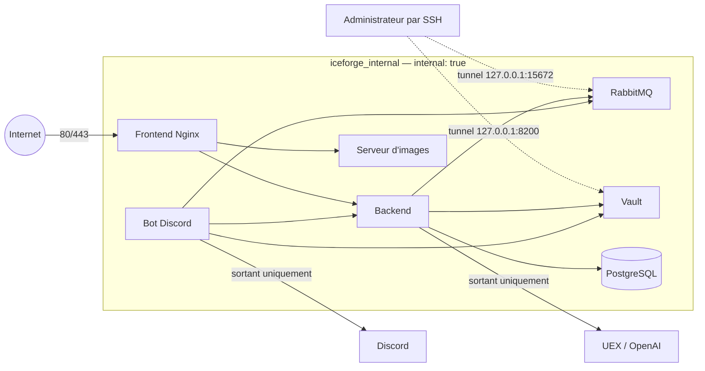

# Cloisonnement réseau de production

Cette opération est volontairement séparée des montées de version. Elle conserve
les images, volumes, variables et commandes actuels, et change uniquement les
publications de ports et l'appartenance aux réseaux Docker.

La surcharge exige Docker Compose **2.24.4 ou supérieur**, car elle emploie le
tag `!override` pour remplacer entièrement les listes. La production auditée
utilise Compose 2.33.1. Voir la documentation Docker sur la
[fusion des fichiers Compose](https://docs.docker.com/reference/compose-file/merge/)
et les [réseaux Compose](https://docs.docker.com/reference/compose-file/networks/).

## Résultat attendu



| Service | Publication après changement | Réseaux |
|---|---|---|
| frontend | `0.0.0.0:80/443` | `internal`, `external` |
| backend, bot | aucune | `internal`, `external` pour les API sortantes |
| RabbitMQ Management | `127.0.0.1:15672` | `internal` |
| Vault | `127.0.0.1:8200` | `internal` |
| PostgreSQL, AMQP, images | aucune | `internal` |

Le binding localhost permet encore un tunnel SSH d'administration, sans rendre
l'API Vault ni RabbitMQ Management joignables depuis Internet. Docker rappelle
qu'un port publié sans adresse d'hôte est lié à toutes les interfaces et peut
être exposé publiquement : [syntaxe des ports](https://docs.docker.com/reference/compose-file/services/#ports).
Le bot et le backend conservent le bridge `external` uniquement pour leurs
connexions sortantes (Discord, UEX, OpenAI). Sans publication `ports`, ce bridge
ne crée aucune écoute sur l'hôte.

Sur l'hôte audité, les bindings localhost de Vault et RabbitMQ sont présents
dans `HostConfig`, mais ne sont pas routés depuis l'hôte lorsque les conteneurs
sont uniquement attachés au réseau `internal`. L'administration courante et les
sauvegardes utilisent donc `docker exec`. Ne pas considérer le tunnel SSH comme
disponible sans un test explicite préalable.

## Préflight sans modification

1. Confirmer que les sauvegardes PostgreSQL, RabbitMQ et Vault sont intègres et
   présentes hors de l'hôte.
2. Confirmer que tous les services sont `running`, avec les compteurs de
   redémarrage relevés.
3. Copier la surcharge et `verify.sh` dans un répertoire protégé du serveur.
4. Valider le modèle résolu sans l'afficher :

```bash
bash verify.sh -- \
  --project-name iceforge \
  --env-file /root/iceforge/.env \
  --env-file /root/iceforge/.secrets/vault/compose.prod.env \
  -f /root/iceforge/docker-compose.yml \
  -f /root/iceforge/docker-compose.vault.yml \
  -f /root/iceforge/ops/network-hardening/docker-compose.network-hardening.yml
```

`verify.sh` garde le JSON Compose résolu uniquement en mémoire, car il contient
les valeurs interpolées de l'environnement. Le second fichier d'environnement
est indispensable : il fournit les chemins et identifiants AppRole de production.
Sans lui, Compose retombe sur les chemins `dev` et des valeurs vides.

## Déploiement par vagues

Toutes les commandes doivent conserver exactement le même projet, les deux mêmes
fichiers d'environnement et les trois mêmes fichiers Compose, dans le même ordre.
Utiliser `docker compose up -d --no-deps --no-build --pull never` afin de refuser
tout build, téléchargement ou changement d'image implicite.

1. Recréer `vault`, l'unseal avec la clé de production, puis vérifier AppRole et
   les lectures KV du backend et du bot. Cette première vague garantit que Vault
   a rejoint `internal` avant que les applications quittent `external`.
2. Recréer `frontend`, `backend` et `icy-images`, puis vérifier la page publique,
   le proxy API et les images.
3. Recréer `bot`, puis vérifier sa connexion Discord, RabbitMQ, Vault et backend.
4. Recréer `db`, puis vérifier PostgreSQL et le backend.
5. Recréer `rabbitmq`, puis vérifier que le volume anonyme est conservé, ainsi
   que ses files, consommateurs et connexions.

Après chaque vague, arrêter immédiatement en cas de service non sain, de compteur
de redémarrage croissant, de réponse HTTP incorrecte ou de perte de connectivité
interne.

## Validation

- depuis Internet, seuls 22, 80 et 443 doivent répondre ;
- depuis l'hôte, `127.0.0.1:8200` et `127.0.0.1:15672` doivent répondre ;
- aucune publication Docker ne doit subsister pour 5432, 5672, 8080, 8081 ou
  8090 ;
- frontend → backend/images, backend/bot → Vault/RabbitMQ et backend → PostgreSQL
  doivent fonctionner sur `iceforge_internal` ; backend et bot doivent aussi
  résoudre et joindre leurs API Internet via `external` ;
- les compteurs de redémarrage doivent se stabiliser.

Le port 111 de l'hôte et le durcissement SSH restent des opérations séparées :
ils ne sont pas gérés par cette surcharge Docker.

## Déploiement du 25 août 2026

La surcharge a été appliquée en production par vagues, sans build, pull ni
changement d'image. Les sept ID d'image observés avant l'opération sont restés
identiques après les recréations.

Résultat final :

- accueil et API publique : HTTP `200` depuis l'extérieur ;
- ports externes ouverts attendus : 22, 80 et 443 ;
- ports 5432, 5672, 15672, 8080, 8081, 8090 et 8200 injoignables depuis
  l'extérieur ;
- sept conteneurs `running`, compteurs de redémarrage à zéro ;
- PostgreSQL 15.13 : même image, même volume, huit tables publiques ;
- RabbitMQ 3.13.7 : même image, même volume anonyme, sept files, zéro message et
  sept consommateurs après reconnexion ;
- Vault 1.17.6 : même image, unseal réussi, AppRole et lecture KV validés pour le
  backend et le bot ;
- aucun nouveau marqueur d'erreur dans les journaux durant les 90 dernières
  secondes de l'observation finale.

Deux écarts ont été détectés et corrigés pendant les vagues :

1. `compose.prod.env` n'était pas passé au premier lancement. Le backend a donc
   reçu un chemin Vault `dev`, des identifiants AppRole vides et un JWT de
   démonstration trop court. Le préflight vérifie maintenant le chemin `prod` et
   la présence des deux identifiants avant toute recréation.
2. Un conteneur attaché uniquement à `internal: true` ne possède pas d'egress
   Internet. Backend et bot conservent donc `external` sans publication de port,
   tandis que les services stateful restent uniquement sur `internal`.

La trace sanitisée d'avant opération est conservée sur l'hôte dans le répertoire
de sauvegardes IceForge. Les scripts de vérification temporaires et leurs traces
en clair sous `/run` doivent être supprimés après fusion de la branche.

## Rollback

Le retour arrière consiste à relancer les mêmes services avec seulement les deux
fichiers Compose historiques, donc sans la surcharge. Aucun volume n'est supprimé
et aucune commande `down` n'est utilisée.

Procéder dans l'ordre inverse (`rabbitmq`, `db`, `bot`, vague HTTP, puis `vault`)
et vérifier chaque service. Pour Vault, refaire l'unseal après la recréation. Le
rollback rétablit temporairement les anciens ports publics ; il ne doit être
utilisé que pour restaurer le service, puis le diagnostic doit reprendre avant
une nouvelle tentative.
