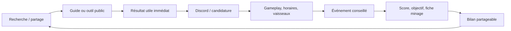
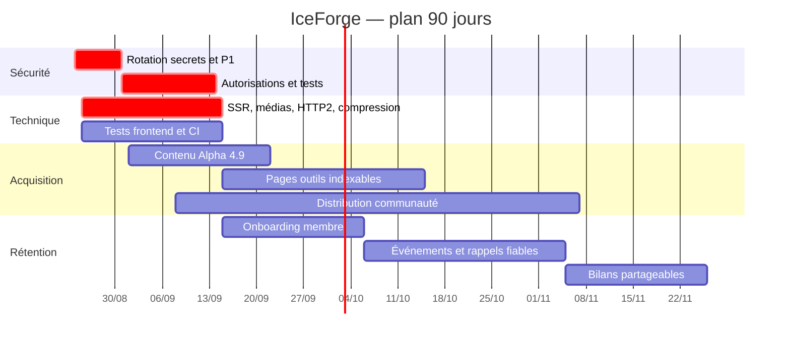
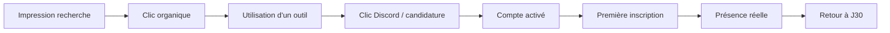

# Feuille de route produit, usage et visibilité

## Cap stratégique

IceForge possède déjà des briques fortes : données Star Citizen, guides, flotte, événements, objectifs, opérations de minage, Discord et temps réel. Le meilleur levier est de les réunir dans une boucle : **un outil public attire un joueur, un événement lui donne une raison de rejoindre, puis ses contributions créent un bilan partageable qui attire le suivant**.

## Priorités 0–90 jours

## 0–72 heures : protéger avant de promouvoir

1. Révoquer la clé bot versionnée, retirer le cog de test et arrêter les logs de credentials.
2. Fermer l'élévation OFFICIER → ADMIN, les mutations globales non protégées, les routes bot accessibles aux membres et les frames STOMP `SEND`.
3. Supprimer les secrets de repli et les ports publics inutiles.
4. Suspendre les récompenses SCWE fondées sur des scores auto-déclarés.
5. Corriger ou isoler les dépendances critiques signalées par npm.

Une campagne d'acquisition avant ces corrections augmenterait la surface d'attaque et la probabilité d'incident.

## 30 jours : rendre le socle fiable et trouvable

### Déploiement et SEO

- déployer le SSR Angular pour chaque route indexable ;
- corriger la whitelist HTTP de `server.ts`, qui classerait actuellement guides et utilitaires en 404 ;
- retourner un vrai 404 pour les routes inconnues ;
- corriger les routes de prérendu (`/guides/...`) ;
- canonical, titre, description et Open Graph présents dans le HTML source ;
- données structurées `Article` pour les guides et `BreadcrumbList` pour guides/utilitaires ;
- sitemap dérivé des routes, avec `lastmod` réel par contenu ;
- flux RSS/Atom pour guides, actualités et changements d'outils ;
- Search Console : soumettre le sitemap, vérifier indexation et Core Web Vitals ;
- analytics respectueux du consentement, sans JWT, pseudo ou Discord ID.

Google recommande le SSR/prérendu pour accélérer utilisateurs et crawlers, notamment parce que tous les robots n'exécutent pas JavaScript. Les canonical doivent être cohérents dès le HTML source : [JavaScript SEO](https://developers.google.com/search/docs/crawling-indexing/javascript/javascript-seo-basics), [canonicalisation](https://developers.google.com/search/docs/crawling-indexing/consolidate-duplicate-urls) et [breadcrumbs](https://developers.google.com/search/docs/appearance/structured-data/breadcrumb).

### Performance

- remplacer l'image de 11,4 MiB par AVIF/WebP locaux, variantes 480/960/1440 px et `srcset` ;
- maîtriser tous les médias tiers, leurs droits et leur disponibilité ;
- Brotli/gzip, HTTP/2 ou HTTP/3, cache immuable sur assets hashés ;
- ne plus appliquer `Cache-Control: no-store` aux bundles et assets ;
- lazy loading réel, `NgOptimizedImage` et dimensions explicites ;
- budgets CI : LCP < 2,5 s, INP < 200 ms, CLS < 0,1 au 75e percentile, conformément aux [Core Web Vitals](https://developers.google.com/search/docs/appearance/core-web-vitals).

### Qualité

- réparer les specs obsolètes et exécuter les tests frontend en CI ;
- tests E2E anonymes, membre, OFFICIER et ADMIN ;
- tests de contrat Angular ↔ backend et backend ↔ bot ;
- corriger les fuites de souscriptions RxJS/STOMP ;
- observabilité : erreurs frontend, taux 5xx, retard RabbitMQ, DLQ, échec Discord et temps des requêtes externes.

## 30–60 jours : gagner des recherches utiles

Le jeu est en Alpha 4.9 depuis juillet 2026, tandis que le guide minage IceForge visible est daté de février et marqué en pause. Les résultats actuels mettent en avant des contenus explicitement 4.9 et des outils interactifs. Chaque page doit afficher la version du jeu, la date de vérification, les sources et ce qui a changé au dernier patch.

### Cluster minage 4.9

- guide débutant 4.9 ;
- scan 4.9 et identification des fragments ;
- Prospector vs MOLE vs Golem vs ROC ;
- têtes, modules et gadgets ;
- raffineries, bonus, temps et lieux ;
- calculateur de rentabilité et route d'achat ;
- check-list d'opération en équipage ;
- FAQ issue des vraies questions Discord.

La demande est visible dans les résultats récents : [patch notes officiels](https://robertsspaceindustries.com/en/patch-notes), [guide FR mis à jour 4.9](https://dawnstar.fr/minage-star-citizen/) et outils 4.9 centrés sur scan, équipements et rentabilité.

### Cluster Wikelo

- qui est Wikelo et où le trouver ;
- contrats, ressources, composants et récompenses par version ;
- fiches par vaisseau avec URL stable ;
- liste d'achats et progression enregistrable ;
- comparateur « ce que je possède → contrats possibles » ;
- alertes lors d'un changement de données.

### Cluster flotte et achat en jeu

- une page indexable par vaisseau : prix, location, rôle, équipage, SCU, lieux ;
- comparateurs par budget, gameplay et taille d'équipage ;
- « quel vaisseau pour débuter sans combat ? » ;
- différence achat en jeu / pledge expliquée clairement ;
- liens internes vers guides et événements correspondants.

### Gabarit d'une page utile

1. réponse courte en haut ;
2. version du jeu et dernière vérification ;
3. données clés lisibles, sourcées et accessibles sans connexion ;
4. méthode détaillée avec captures optimisées ;
5. erreurs fréquentes ;
6. outil ou checklist actionnable ;
7. liens vers pages liées ;
8. CTA contextuel vers une opération correspondante.

## 45–90 jours : augmenter l'usage des joueurs

### Onboarding en moins de trois minutes

À la première connexion, demander gameplay préféré, horaires/fuseau, solo ou équipage, vaisseaux possédés, niveau et objectif. Proposer immédiatement un guide, un prochain événement, un rôle Discord et une action simple.

Discord recommande son Onboarding natif pour attribuer rôles et salons et réduire l'abandon : [Community Onboarding](https://discord.com/blog/community-onboarding-welcome-your-new-members) et [Server Guide](https://support.discord.com/hc/en-us/articles/13497665141655-Server-Guide-FAQ).

### Boucle événement

- calendrier public en lecture seule, avec places et gameplay ;
- ajout calendrier `.ics` ;
- inscription depuis le site ou Discord avec confirmation fiable ;
- rappel 24 h / 1 h configurable ;
- check-in puis bilan automatique ;
- prochaines actions recommandées selon participation ;
- demande de push seulement après une action explicite, pas au chargement de la topbar.

### Preuves sociales utiles

- opérations réalisées ce mois, heures collectives et objectifs atteints ;
- portraits de membres volontaires ;
- bilans d'opération partageables avec consentement ;
- page publique de corporation claire : rythme, valeurs, fuseaux, gameplay et niveau attendu ;
- aucune exposition de Discord ID ou statut individuel sans opt-in explicite.

### Fonctionnalités à fort levier

| Initiative | Impact | Effort | KPI principal |
|---|---:|---:|---|
| SSR correct + canonical source | très fort | moyen | pages indexées, clics organiques |
| médias optimisés | très fort | faible | LCP, rebond |
| guides 4.9 + pages vaisseaux | très fort | moyen | visiteurs non marque |
| onboarding personnalisé | fort | moyen | activation J1 |
| événements publics + `.ics` | fort | moyen | visiteur → participant |
| rappels Discord fiables | fort | moyen | taux de présence |
| bilans partageables | fort | moyen | invitations, trafic référent |
| calculateur minage | très fort | élevé | utilisateurs récurrents |
| gamification générique | moyen | élevé | différer tant que la boucle n'est pas mesurée |

## Distribution et visibilité

1. **Google/Bing** : clusters 4.9, pages outils indexables, Search Console et Bing Webmaster Tools.
2. **RSI** : tenir la page Organization à jour et publier les meilleurs guides sur le Community Hub avec un résumé utile. Le [hub Organizations officiel](https://robertsspaceindustries.com/en/community/orgs/) sert à la découverte d'organisations.
3. **Discord** : activer Community, Onboarding, Server Guide, annonces suivables, Insights et éligibilité Discovery. Les critères évoluent ; vérifier les paramètres actuels ([Community Servers](https://docs.discord.com/developers/platform/community-servers)).
4. **YouTube/Twitch** : une vidéo courte par guide majeur, chapitres, transcription et lien vers l'outil.
5. **Reddit/Spectrum** : répondre d'abord à une question réelle avec la substance dans le post, puis proposer l'outil ; éviter le spam croisé.
6. **Partenariats FR** : opérations croisées, échanges de guides, Bar Citizen et créateurs industrie/logistique.

### Cohérence de marque et politique fan

Les liens sociaux divergent entre JSON-LD et cartes de la home. Définir une source unique pour Discord, Twitch et X. La politique fan RSI mise à jour en janvier 2026 exige un avertissement visible de site non officiel et un lien vers le site officiel : [Fankit and Fandom FAQ](https://support.robertsspaceindustries.com/hc/en-us/articles/360006895793-Star-Citizen-Fankit-and-Fandom-FAQ). Remplacer le disclaimer approximatif par le texte conforme et vérifier les médias tiers.

## Mesure du funnel

| Étape | KPI | Définition |
|---|---|---|
| Acquisition | clics non marque | clics sur requêtes hors « IceForge » |
| Valeur | taux d'outil utile | session avec recherche, calcul ou détail |
| Conversion | outil → Discord/candidature | clic contextualisé / utilisateurs outil |
| Activation | première action en 24 h | profil, participation ou ajout de vaisseau |
| Engagement | membres actifs 7 j | action métier, pas simple ouverture |
| Événement | présence / inscriptions | check-ins / inscrits |
| Rétention | J30 | membres revenus et actifs à 30 jours |
| Viralité | invitations attribuées | nouveaux membres issus d'un lien partagé |
| Fiabilité | succès notifications | confirmations Discord réelles / tentatives |

Événements analytics minimaux : `guide_viewed`, `tool_searched`, `tool_result_opened`, `discord_cta_clicked`, `application_started`, `application_submitted`, `onboarding_completed`, `event_joined`, `event_checked_in`, `share_created`. Ajouter `content_version` et `game_version`, jamais un token ou une donnée Discord brute.

## Critères de réussite à 90 jours

- aucun P0/P1 sécurité ouvert ;
- HTML source et statut HTTP corrects pour 100 % des routes indexables ;
- LCP mobile terrain < 2,5 s au 75e percentile ;
- suites backend, frontend, bot et E2E vertes en CI ;
- contenu principal explicitement à jour pour Alpha 4.9 ;
- au moins un outil public avec usage récurrent mesuré ;
- funnel visiteur → Discord → première participation instrumenté ;
- amélioration simultanée des clics non marque, du taux de présence et de la rétention J30.
