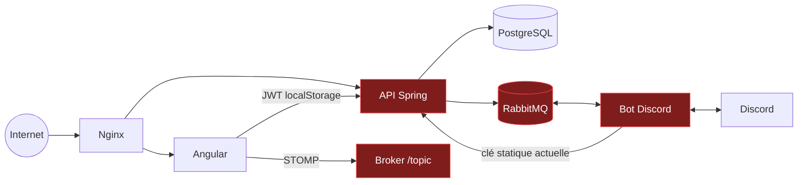

# Audit de sécurité

Date : **24 août 2026**
Périmètre : backend Spring Boot, bot Discord, frontend Angular, WebSocket, RabbitMQ, Docker/Nginx, dépendances et production observable.

Ce document conserve les constats du code et du déploiement antérieurs à la
modernisation. Plusieurs correctifs existent maintenant dans le dépôt local
(clé bot retirée du code, cog de test supprimé, dépendances et images durcies),
mais la production exécute encore les anciens artefacts. Un risque n'est donc
considéré fermé qu'après rotation des secrets concernés et promotion de l'image
corrigée.

## Résumé exécutif

Le projet ne doit pas être considéré comme suffisamment cloisonné tant que les P0/P1 ne sont pas corrigés. Le risque dominant est l'authentification et l'autorisation interservices : une clé bot est versionnée, plusieurs mutations backend sensibles sont accessibles à tout membre authentifié, un OFFICIER peut probablement se promouvoir ADMIN et les clients STOMP peuvent envoyer vers le broker sans règle explicite sur `SEND`.

## P0 — action immédiate

### Services avec état exposés sur Internet

L'audit SSH du 24 août 2026 et un test TCP externe ont confirmé que PostgreSQL
`5432`, RabbitMQ `5672/15672` et Vault `8200` sont joignables depuis Internet.
Vault et RabbitMQ Management répondent en HTTP clair. Le pare-feu de l'hôte est
inactif, SELinux est désactivé et SSH autorise root par mot de passe.

Restreindre d'abord les ports au niveau de l'hébergeur, sans recréer les
conteneurs stateful, puis retirer leurs publications du Compose après sauvegarde
et test de restauration. L'état complet et le rollback sont décrits dans
[`PRODUCTION-ARCHITECTURE.md`](PRODUCTION-ARCHITECTURE.md).

### Clé backend du bot codée en dur et présente dans Git

Le header d'authentification est une valeur littérale dans [`icy/cogs/api_client.py:13-15`](../icy/cogs/api_client.py#L13-L15), alors que `BOT_API_KEY` est prévu par l'environnement. Le fichier a porté cette valeur littérale dans les deux commits de son historique audité.

Impact : usurpation du bot, selon les contrôles réellement appliqués côté backend. La valeur n'est volontairement pas reproduite dans ce document.

Actions :

1. révoquer et renouveler immédiatement la clé côté backend ;
2. vérifier les journaux d'accès pour des usages anormaux ;
3. charger uniquement `BOT_API_KEY` depuis Vault ou un secret Docker ;
4. purger la valeur de l'historique si le dépôt, une archive ou un fork a été partagé ;
5. invalider toutes les anciennes valeurs après purge ;
6. ajouter un secret scan bloquant en CI.

## P1 — élevés

### Autorisations backend

#### OFFICIER peut s'attribuer ADMIN

Les endpoints de création/modification acceptent `ADMIN` ou `OFFICIER`, puis le service applique le rôle demandé par le client sans contrôler le rôle cible :

- [`UserController.java:44-53`](../icy_backend/src/main/java/com/icy/icy_backend/controller/user/UserController.java#L44-L53) ;
- [`UserService.java:106-138`](../icy_backend/src/main/java/com/icy/icy_backend/service/user/UserService.java#L106-L138) ;
- [`UserService.java:410-440`](../icy_backend/src/main/java/com/icy/icy_backend/service/user/UserService.java#L410-L440).

Réserver l'attribution d'ADMIN à ADMIN, interdire l'auto-promotion et tester toutes les combinaisons rôle appelant × rôle cible.

#### Mutations globales accessibles à tout utilisateur authentifié

La règle par défaut est simplement `.anyRequest().authenticated()` dans [`SecurityConfig.java:41-64`](../icy_backend/src/main/java/com/icy/icy_backend/security/SecurityConfig.java#L41-L64). Plusieurs endpoints n'ajoutent aucun contrôle métier : objectifs et modèles, collections, IceLink, SC World Events et types, participation tierce et routes bot basées sur un `discordId` fourni par le client.

Preuves principales :

- [`GoalController.java:21-65`](../icy_backend/src/main/java/com/icy/icy_backend/controller/goal/GoalController.java#L21-L65) ;
- [`GoalTemplateController.java:26-53`](../icy_backend/src/main/java/com/icy/icy_backend/controller/goal/GoalTemplateController.java#L26-L53) ;
- [`CollectionController.java:45-49`](../icy_backend/src/main/java/com/icy/icy_backend/controller/collection/CollectionController.java#L45-L49) ;
- [`IceLinkBlockController.java:18-31`](../icy_backend/src/main/java/com/icy/icy_backend/controller/icelink/IceLinkBlockController.java#L18-L31) ;
- [`ScWorldEventController.java:79-94`](../icy_backend/src/main/java/com/icy/icy_backend/controller/scworldevent/ScWorldEventController.java#L79-L94) ;
- [`UserShipController.java:72-98`](../icy_backend/src/main/java/com/icy/icy_backend/controller/user/UserShipController.java#L72-L98).

Créer une matrice d'autorisation centrale, ajouter `@PreAuthorize` côté contrôleur et service, et donner au bot une identité machine distincte avec audience et permissions minimales.

#### Broadcasts WebSocket falsifiables

Le simple broker accepte `/topic`, tandis que l'intercepteur contrôle `CONNECT` et `SUBSCRIBE`, pas `SEND` : [`WebSocketConfig.java:29-54`](../icy_backend/src/main/java/com/icy/icy_backend/config/WebSocketConfig.java#L29-L54).

Refuser toute frame client `SEND` si aucune messagerie entrante n'est requise. Sinon, n'autoriser que `/app/**`, interdire `/topic/**` et tester identités tierces, rôles, token expiré et destination inconnue.

#### Scores SCWE auto-déclarés

Un joueur envoie directement sa carte de points. La validation accepte les clés et minima mais ignore les maxima, puis le score agrégé peut déclencher paliers et récompenses :

- [`ScWorldEventParticipationController.java:48-60`](../icy_backend/src/main/java/com/icy/icy_backend/controller/scworldevent/ScWorldEventParticipationController.java#L48-L60) ;
- [`ScWorldEventParticipationService.java:127-209`](../icy_backend/src/main/java/com/icy/icy_backend/service/scworldevent/ScWorldEventParticipationService.java#L127-L209).

Enregistrer des contributions unitaires auditables, appliquer bornes et variation maximale, exiger validation serveur/officier et rendre chaque contribution idempotente.

#### Secret JWT de repli

[`docker-compose.yml:23-27`](../docker-compose.yml#L23-L27) définit un secret JWT de repli connu. Si la variable manque, un attaquant connaissant le dépôt peut forger des tokens. Supprimer tout fallback et faire échouer le démarrage sur valeur absente, placeholder ou entropie insuffisante.

### Bot Discord et RabbitMQ

#### Cog de test chargé en production

Le bot de l'audit initial chargeait automatiquement tous les `.py` de `cogs`
dans [`bot.py`](../icy/bot.py). L'ancien `icy/cogs/test_cog.py` répondait à
chaque message humain, interrogeait un utilisateur codé en dur et republiait la
réponse backend. Ce fichier a été supprimé du dépôt modernisé ; la promotion de
l'image corrigée reste à faire en production.

Retirer ce cog du runtime, définir une liste explicite d'extensions et remplacer ce comportement par des tests isolés.

#### Perte silencieuse de messages

[`rabbit_manager.py:70-87`](../icy/messaging/rabbit_manager.py#L70-L87) capture les exceptions à l'intérieur de `message.process()`. Le contexte se termine normalement et acquitte alors le message en erreur. Il n'existe ni DLQ, ni retry/backoff, ni validation de schéma.

Ajouter files de retry et DLQ, catégories d'erreurs, prefetch, identifiant d'événement et idempotence.

#### Faux succès lors d'une participation

[`message_publisher.py:15-41`](../icy/messaging/message_publisher.py#L15-L41) absorbe les exceptions, tandis que [`event_handler.py:546-559`](../icy/messaging/event_handler.py#L546-L559) confirme toujours le succès à l'utilisateur. Activer publisher confirms et ne répondre « enregistré » qu'après confirmation.

#### Credentials RabbitMQ dans les logs

L'URL AMQP construite dans [`bot.py:39-46`](../icy/bot.py#L39-L46) contient utilisateur et mot de passe, puis elle est journalisée dans [`rabbit_manager.py:37-42`](../icy/messaging/rabbit_manager.py#L37-L42). Faire tourner le mot de passe si les logs ont été conservés et ne journaliser que hôte, port, vhost et utilisateur.

#### Broker et management exposés

Le compose audité publiait 5672 et 15672 et acceptait un mot de passe de repli
connu. L'audit de production confirme que RabbitMQ, PostgreSQL, backend, images
et Vault sont effectivement publiés sur l'hôte.

Ne publier que 80/443. Utiliser réseau privé, TLS AMQP, permissions de vhost minimales et accès administrateur par tunnel/VPN.

#### Mots de passe temporaires en clair

Le backend place le mot de passe temporaire dans RabbitMQ, le bot le reçoit puis l'envoie en DM :

- [`UserPublisher.java:17-30`](../icy_backend/src/main/java/com/icy/icy_backend/messaging/UserPublisher.java#L17-L30) ;
- [`user_handler.py:22-34`](../icy/messaging/user_handler.py#L22-L34).

Le payload complet peut aussi être journalisé en développement. Remplacer par un lien de création/réinitialisation à usage unique et durée courte.

#### Endpoint dormant sans authentification

[`bot_api.py:21-33`](../icy/utils/bot_api.py#L21-L33) permettrait de demander l'envoi d'un mot de passe sans authentification ni rate limit. Le serveur n'est pas lancé actuellement, mais le port 8090 est publié. Supprimer le module et le port.

### Dépendances frontend

`npm audit --omit=dev` signale **1 vulnérabilité critique et 12 élevées** sur l'arbre de production, notamment `websocket-driver`, Angular, PostCSS et `nanoid`. L'audit complet signale 29 vulnérabilités.

Mettre à jour sur une branche dédiée, vérifier les avis, reconstruire SSR, puis retester hydratation, WebSocket, éditeur riche, service worker et E2E. La sévérité d'un avis n'est pas à elle seule une preuve d'exploitabilité dans IceForge, mais l'arbre actuel ne doit pas rester figé.

## P2 — modérés

### Frontend et bordure HTTP

- access et refresh tokens dans `localStorage` : [`auth.service.ts:26-31`](../icy-angular/src/app/core/services/auth/auth.service.ts#L26-L31) ;
- refresh tenté sur tout 401 **et 403**, pouvant transformer un refus de rôle en déconnexion : [`http.interceptor.ts:45-65`](../icy-angular/src/app/core/interceptors/http.interceptor.ts#L45-L65) ;
- aucun CSP, HSTS, `Referrer-Policy` ou `Permissions-Policy` observé sur les pages frontend ;
- Nginx révèle sa version et n'active ni HTTP/2 ni compression texte ;
- médias externes nombreux, élargissant la chaîne de confiance ;
- cinq boutons de carte sans nom accessible et plusieurs champs sans label associé.

### Validation, abus et concurrence backend

- aucun usage généralisé de Bean Validation trouvé ;
- POST recrutement public sans rate limit/CAPTCHA et DTO acceptant des champs serveur ;
- login sans throttling progressif et réponses facilitant l'énumération ;
- tailles de page non bornées ;
- mises à jour d'objectifs multi-écritures sans transaction/verrou optimiste ;
- `username` non unique alors que le repository attend un résultat unique ;
- Vault en HTTP par défaut ;
- migrations V21-V28 absentes du manifeste d'immutabilité et aucun test PostgreSQL réel.

### Bot

- connexion/consommation RabbitMQ recréée à chaque `on_ready` sans fermeture ;
- client HTTP sans timeout, session partagée ni contrôle robuste des statuts ;
- ordre des cogs non déterministe ;
- `create_event` cassée et sans contrôle de rôle ;
- vue de flotte sans contrôle du propriétaire de l'interaction ;
- limites Discord et mentions non bornées ;
- état des rappels uniquement en mémoire ;
- conteneurs backend et bot exécutés en root.

## Points positifs

- access tokens courts, types JWT distincts et refresh rotation/replay protection ;
- refresh tokens hachés en base ;
- BCrypt et reset token court ;
- CORS sur liste exacte, sans wildcard ;
- uploads d'images contrôlés par taille, extension, signature et chemin normalisé ;
- requêtes observées paramétrées, sans concaténation SQL issue de l'entrée HTTP ;
- dossiers `.env`, secrets locaux, caches et artefacts exclus de Git ;
- l'API Actuator renvoie 403 anonymement en production ;
- routes privées frontend redirigées vers la connexion et marquées `noindex` après rendu.

## Vérifications et niveau de confiance

| Contrôle | Résultat |
|---|---|
| Backend Maven | 108 tests, 0 échec |
| Couverture backend | 31,2 % lignes ; 7,2 % branches |
| Tests sécurité backend | incomplets ; plusieurs contrôleurs désactivent les filtres |
| Build frontend | réussi |
| Tests frontend | bloqués à la compilation des specs |
| Audit npm production | 1 critique, 12 élevées |
| Python | 25 fichiers parsés ; `pip check` réussi |
| Tests bot | aucun |
| Compose | syntaxe valide |
| Pentest actif | non exécuté |

## Plan de remédiation sécurité

### 0–24 h

- rotation/purge de la clé bot ;
- retrait du cog de test ;
- arrêt des logs d'URL AMQP et rotation des credentials concernés ;
- suppression des secrets de repli JWT/RabbitMQ ;
- restriction des ports non HTTP.

### 24–72 h

- corriger OFFICIER → ADMIN ;
- protéger toutes les mutations globales et routes bot ;
- interdire STOMP `SEND` vers `/topic/**` ;
- borner et auditer les scores SCWE ;
- désactiver l'endpoint dormant ;
- déployer une première mise à jour des dépendances critiques.

### 7–30 jours

- matrice d'autorisation testée avec la vraie chaîne Spring Security ;
- DLQ/retry/idempotence/publisher confirms ;
- refresh token en cookie HttpOnly et CSP stricte ;
- rate limiting login/recrutement et Bean Validation ;
- transactions/verrouillage sur objectifs ;
- Testcontainers PostgreSQL pour migrations ;
- CI avec secret scan, SAST, dependency scan, SBOM et scan d'images Docker.

### Critère de sortie

Aucun P0/P1 ouvert, tests négatifs 401/403 pour chaque mutation, test STOMP `SEND`, simulation de panne RabbitMQ sans perte, suite frontend verte, dépendances critiques corrigées ou explicitement non exploitables avec justification documentée.
