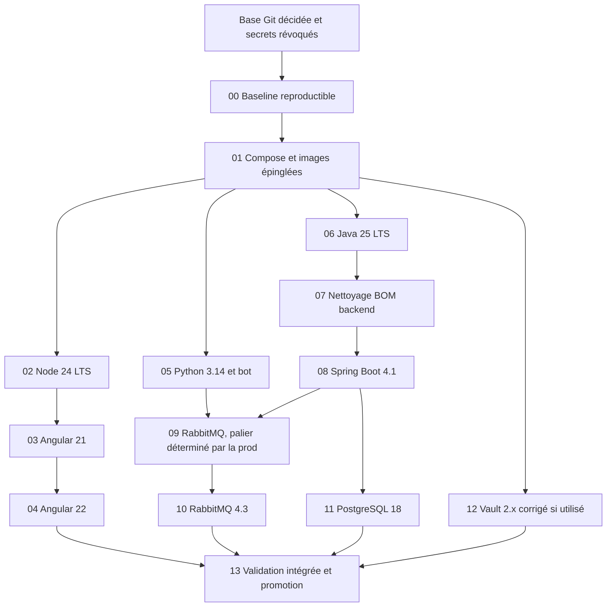

# Plan de modernisation technique

Date de référence : **24 août 2026**

Ce plan couvre les runtimes, frameworks, dépendances, images Docker et services
avec état d'IceForge. Il est conçu pour avancer **une branche et un déploiement à
la fois**, avec une validation et un retour arrière explicites à chaque étape.

## Décision de méthode

- Une branche ne porte qu'un changement de plateforme ou un groupe de
  dépendances cohérent.
- Chaque branche part de `main` après fusion et validation de la précédente.
- Aucun changement fonctionnel ni migration métier Flyway ne doit être mélangé
  à une montée de version.
- Les tags Docker flottants (`latest`, `alpine`, `3-management`,
  `stable-alpine`) sont d'abord remplacés par des versions explicites, puis par
  des digests immuables lors de la promotion en production.
- Les composants avec état (PostgreSQL, RabbitMQ et Vault) passent après les
  clients applicatifs et nécessitent un essai de restauration ou de migration.
- Une version RC, milestone, preview ou une branche non-LTS n'est pas une cible
  de production.

## Situation actuelle et cibles

| Composant | Dépôt actuellement | Cible recommandée | Priorité | Décision |
|---|---:|---:|---|---|
| Node.js | `24.19.0-alpine3.24` | Node 24 LTS | Terminée | Runtime, npm, `.nvmrc` et images SPA/SSR épinglés |
| Angular | 22.1.3 (CLI/SSR 22.1.5) | 22.1.x | Terminée | Migrations 20→21 puis 21→22 validées sur deux branches isolées |
| TypeScript | 6.0.3 | 6.0.x imposée par Angular | Terminée | Alias de tests migré sans masquer la dépréciation de `baseUrl` |
| Java | Temurin 25.0.4 LTS | Temurin 25 LTS | Terminée | 108 tests, JaCoCo, Flyway, AMQP et smoke REST validés |
| Spring Boot | 4.1.1 | dernière stable 4.1.x | Terminée | Migration majeure validée avec Spring Framework 7, Security 7, Hibernate 7 et Flyway 12 |
| Maven | wrapper 3.9.9 | 3.9.9 | Basse | Déjà satisfaisant ; ajouter une règle Enforcer |
| Python | `3.14.7-alpine3.24` | Python 3.14.x | Terminée | Image immuable, wheels musllinux et exécution non-root validées |
| discord.py | 2.7.1 | 2.7.1 | Basse | Déjà à la dernière version publiée |
| Dépendances du bot | verrou transitif | dernières stables compatibles | Terminée | 5 tests unitaires, audit CVE et test AMQP réel validés |
| PostgreSQL | 18.6 épinglé | dernière 18.x stable | Terminée | Dump/restore 15.19→18.6, intégrité, persistance, application et rollback validés localement |
| Pilote PostgreSQL | 42.7.13 | BOM Spring ou dernière stable compatible | Basse | Éviter de le sur-épingler sans raison |
| RabbitMQ | 4.3.5 épinglé | dernière 4.3.x stable | Terminée | Paliers 3.13→4.2→4.3 et restaurations de rollback validés localement |
| Nginx | 1.30.4 épinglé | stable épinglée | Terminée | Frontend et serveur d'images sont uniformisés |
| Vault | 1.17.6 épinglé | 2.0.5+ Community corrigée | Bloquée éditeur | Migration et rollback 1.17.6→2.0.4 prouvés ; attendre une image sans CVE Go corrigible |
| Docker Compose | base + surcharges dédiées | socle durci | Terminée | Production, local et validation sont séparés |

Sources de compatibilité et de cycle de vie : [Angular](https://angular.dev/reference/releases),
[compatibilité Angular](https://next.angular.dev/reference/versions),
[Spring Boot](https://docs.spring.io/spring-boot/documentation.html),
[Node.js](https://nodejs.org/en/about/previous-releases),
[Temurin](https://adoptium.net/support/),
[Python](https://www.python.org/downloads/),
[discord.py](https://pypi.org/project/discord.py/),
[PostgreSQL](https://www.postgresql.org/support/versioning/),
[RabbitMQ](https://www.rabbitmq.com/release-information),
[Nginx](https://nginx.org/en/download.html) et
[Docker Compose en production](https://docs.docker.com/compose/how-tos/production/).

## Dépendances entre les branches

Le graphe exprime des dépendances techniques, pas une obligation de livrer
toutes les branches avant de remettre une amélioration en production. Chaque
branche validée peut être déployée avant de commencer la suivante.

## Séquence de branches

### Préflight hors migration

Avant toute branche de version :

1. Révoquer et renouveler la clé backend du bot exposée dans l'historique Git.
2. Désactiver le cog de test chargé automatiquement.
3. Décider de la base Git. La branche courante `agent/security-bug-audit` est
   douze commits devant `main` et la documentation est encore non commitée.
4. Étiqueter le commit correspondant à la production actuelle et relever les
   digests des images réellement déployées.
5. Ne pas donner de secret, mot de passe ou clé privée dans le chat ou dans un
   fichier versionné.

### 00 — `codex/chore-upgrade-baseline`

But : obtenir une référence fiable avant de toucher aux versions.

- Corriger la compilation des tests Angular et exécuter au minimum les tests
  critiques d'authentification, navigation et appels API.
- Conserver les 108 tests Maven au vert et ajouter un smoke test avec
  PostgreSQL/RabbitMQ éphémères si l'environnement CI le permet.
- Ajouter une vérification syntaxique et quelques tests du bot.
- Déclarer les versions attendues de Node, npm, Java, Maven et Python.
- Ajouter Maven Enforcer, des audits de dépendances et une génération SBOM.
- Capturer les temps de démarrage, tailles d'images et résultats de smoke tests.

Acceptation : mêmes fonctionnalités, aucune nouvelle vulnérabilité critique,
builds reproductibles depuis un poste propre.

### 01 — `codex/infra-compose-foundation`

But : rendre Docker prévisible sans encore changer de version majeure.

- Créer un Compose de base et un override de production.
- Épingler les versions patch actuelles et supprimer `latest`/tags flottants.
- Construire le frontend dans son image au lieu de monter un répertoire de code.
- Ajouter healthchecks, `depends_on: condition: service_healthy`, utilisateurs
  non-root lorsque possible, limites CPU/mémoire/PID et systèmes de fichiers en
  lecture seule lorsque compatibles.
- Retirer de l'hôte les ports PostgreSQL, RabbitMQ, management RabbitMQ, bot et
  serveur d'images qui n'ont pas besoin d'être publics.
- Ne jamais inclure les valeurs de secrets dans `docker compose config` archivé
  ou dans les journaux CI.

Acceptation : `docker compose config` valide, démarrage à froid réussi, données
persistantes après recréation et rollback par anciens digests.

### 02 — `codex/upgrade-node-24`

État : **validée localement le 24 août 2026** avec Node 24.19.0 LTS et npm
11.17.0. Les 47 tests, les builds SPA/SSR, le smoke SSR et l'audit de production
sont au vert.

- Passer les Dockerfiles frontend de Node 20 EOL à Node 24 LTS.
- Ajouter `engines.node` et une version de gestionnaire de paquets.
- Régénérer le lockfile avec l'outil retenu, sans changement Angular.
- Vérifier build SPA, SSR, service worker et budgets de bundles.

### 03 — `codex/upgrade-angular-21`

État : **validée localement le 24 août 2026** avec Angular/CLI/SSR 21.2.21,
CDK 21.2.14 et FullCalendar 6.1.21. Les 47 tests, les builds SPA/SSR, quatre
routes prérendues, 14 routes publiques, quatre vues mobiles et deux gardes
privées sont au vert. L'audit des dépendances de production est à zéro.

Le parcours a aussi révélé que la redirection Nginx d'une route prérendue perd
le port de développement. Ce défaut d'infrastructure, indépendant d'Angular,
est réservé à `codex/fix-nginx-prerender-redirect`.

- Exécuter les migrations officielles Angular 20 vers 21.
- Aligner core, CLI, CDK, SSR et compiler ; ne pas mettre à jour les autres
  bibliothèques sans nécessité de compatibilité.
- Tester les routes publiques, l'authentification, les WebSockets et le rendu
  serveur.

### 04 — `codex/upgrade-angular-22`

État : **validée localement le 24 août 2026** avec Angular/CDK 22.1.3,
CLI/SSR 22.1.5 et TypeScript 6.0.3. Les 47 tests, les images SPA/SSR, quatre
routes prérendues, 14 routes publiques, quatre vues mobiles et deux gardes
privées sont au vert. L'audit de production et l'arbre npm sont à zéro erreur.
Le bundle initial atteint 740,27 kB, sous la limite de 1,2 MB.

- Exécuter Angular 21 vers 22 et passer à TypeScript 6.0.x.
- Aligner notamment CDK, SSR, FullCalendar, Angular Editor, Overview et Hot
  Toast sur leurs versions compatibles Angular 22.
- Réévaluer les anciennes bibliothèques STOMP/SockJS et retirer celles qui sont
  inutilisées.
- Faire un Lighthouse comparatif et interdire toute régression de bundle/LCP.

Acceptation frontend : tests au vert, aucune vulnérabilité critique en
production, toutes les routes auditées en HTTP 200/30x attendu, SSR et PWA
fonctionnels, smoke test mobile.

Suites isolées : migrer le builder Karma/Webpack vers `@angular/build`/Vitest,
puis remplacer le `CommonEngine` déprécié par `AngularNodeAppEngine`. Le serveur
SSR conserve entre-temps une allowlist explicite (`iceforge.fr`,
`www.iceforge.fr`, `localhost`, `127.0.0.1`) surchargeable via
`NG_ALLOWED_HOSTS`.

### 05 — `codex/upgrade-python-3-14-bot`

- Passer l'image à Python 3.14.x.
- Conserver discord.py 2.7.1, déjà à jour.
- Mettre à jour séparément dans le même lock cohérent : python-dotenv 1.2.3,
  FastAPI 0.141.x, Uvicorn 0.52.x, aio-pika 10.x et soupsieve 2.9.x.
- Remplacer `requirement.txt` par un mécanisme verrouillé avec hashes ou ajouter
  un fichier de contraintes généré.
- Tester connexion Discord, synchronisation des commandes, reconnexion AMQP,
  publication, consommation, accusés de réception et arrêt propre.

Résultat : Python 3.14.7 et les dépendances cibles sont verrouillés. Toutes les
dépendances natives ont une wheel CPython 3.14, `pip check` et `pip-audit` sont
verts, cinq tests unitaires passent et le cycle publication/consommation a été
validé avec RabbitMQ 3.13.7 dans un réseau éphémère. La connexion Discord et la
synchronisation des commandes restent à vérifier lors du déploiement contrôlé,
sans réutiliser de secret dans les tests locaux.

### 06 — `codex/upgrade-java-25`

- Passer compilation et images Temurin 21 à Temurin 25 LTS.
- Garder Spring Boot 3.5.16 et toutes les dépendances fonctionnelles inchangées.
- Exécuter tests, JaCoCo, démarrage, Flyway validate et smoke REST/WebSocket.

Cette branche isole les éventuelles incompatibilités JDK de celles de Spring.

Résultat : Spring Boot reste en 3.5.16 et les dépendances fonctionnelles sont
inchangées. L'annotation processor Lombok utilise désormais la version 1.18.46
gérée par le parent, et JaCoCo 0.8.15 remplace 0.8.11 pour supporter le bytecode
Java 25. Le build Temurin 25.0.4 a compilé 294 sources, exécuté 108 tests et
analysé 204 classes. Le smoke test isolé a appliqué et validé 28 migrations sur
PostgreSQL 15.19, établi la connexion RabbitMQ, servi un endpoint REST en HTTP
200, confirmé le transport SockJS avec WebSocket activé et fermé proprement le
pool Hikari à l'arrêt.

### 07 — `codex/upgrade-backend-dependencies`

- Laisser Spring Boot gérer au maximum son BOM.
- Supprimer ou justifier les surcharges globales Jackson 2.21.5 et Logback
  1.5.35 avant le changement de génération Spring.
- Mettre à jour uniquement les dépendances directes compatibles avec Boot 3.5 :
  Bouncy Castle, jsoup, commons-csv et plugins Maven stables.
- Traiter `httpclient` 4.5 et `async-http-client` 2 comme migrations de code, pas
  comme simples changements de numéro.
- Ne pas suivre les suggestions Maven milestone, alpha, preview ou RC.

Résultat : Bouncy Castle passe de 1.84 à 1.85.2, jsoup de 1.22.2 à
1.23.1 et Commons CSV de 1.13.0 à 1.14.1. Les plugins CycloneDX,
Surefire, Compiler et JAR passent respectivement à 2.9.3, 3.5.6, 3.15.0
et 3.5.1. Jackson 2.21.5 et Logback 1.5.35 restent volontairement
surchargés : Spring Boot 3.5.16 gère encore 2.21.4 et 1.5.34, donc les
retirer aurait constitué une régression. `httpclient` 4.5 et
`async-http-client` 2 restent inchangés pour être migrés séparément ; le
transitif `commons-logging` de HttpClient a toutefois été exclu au profit du
pont `spring-jcl` déjà fourni par Spring.

Le build Java 25 a recompilé 294 sources et exécuté 108 tests. Le SBOM
CycloneDX contient désormais 124 composants. Le smoke test isolé a validé les
28 migrations sur PostgreSQL 15.19, la connexion RabbitMQ, REST en HTTP 200,
SockJS/WebSocket et l'arrêt gracieux de Hikari. Un second démarrage après
l'exclusion a confirmé la disparition de l'avertissement Commons Logging.

### 08 — `codex/upgrade-spring-boot-4-1`

- Passer de Boot 3.5.16 à la dernière 4.1.x stable.
- Utiliser temporairement `spring-boot-properties-migrator` et le retirer avant
  fusion.
- Traiter Spring Framework 7, Spring Security, Hibernate/JPA, AMQP, Jackson et
  Actuator comme surfaces de régression majeures.
- Tester explicitement toutes les règles d'autorisation, les refresh tokens,
  Flyway, les sérialisations JSON, les échanges RabbitMQ et STOMP.

Acceptation backend : 108 tests historiques plus nouveaux tests de sécurité au
vert, zéro modification involontaire du schéma, contrats API comparés et smoke
test avec les images cibles.

Résultat : Spring Boot passe de 3.5.16 à 4.1.1 avec Spring Framework 7.0.9,
Spring Security 7.1.1, Hibernate 7.4.5.Final, Tomcat 11.0.24, Spring AMQP
4.1.1, Flyway 12.4.0 et JUnit 6.0.3. Les starters modulaires Boot 4 remplacent
les anciens starters génériques ; Flyway utilise en plus son module PostgreSQL.
Les tests MVC suivent les nouveaux packages Boot 4 et `@MockitoBean` remplace
le `@MockBean` supprimé. Le convertisseur RabbitMQ utilise Jackson 3.

Le code métier expose encore largement les types Jackson 2 ; le module officiel
`spring-boot-jackson2` est donc conservé comme pont temporaire. La migration
complète des types `com.fasterxml.jackson.databind` vers Jackson 3 fera l'objet
d'une branche distincte afin de ne pas mélanger contrats JSON et changement de
framework. Le migrateur de propriétés n'a signalé aucun renommage et a été
retiré avant fusion.

Le build final compile 294 sources, exécute 108 tests et analyse 204 classes ;
le SBOM contient 151 composants. Le smoke test isolé valide les 28 migrations
sur PostgreSQL 15.19, Hibernate/JPA, une connexion RabbitMQ active, REST en HTTP
200, le handshake SockJS/WebSocket, Java 25.0.4, l'UID non-root 10001 et l'arrêt
gracieux de Hikari. Le premier démarrage a détecté l'absence du module Flyway
PostgreSQL ; le module a été ajouté et le second démarrage a confirmé un schéma
à jour en version 28.

### 09/10 — RabbitMQ

Branches conditionnelles :

- `codex/upgrade-rabbitmq-3-13` si la production est antérieure à 3.13 ;
- `codex/upgrade-rabbitmq-4-2` comme palier supporté depuis 3.13 ;
- `codex/upgrade-rabbitmq-4-3` pour la série communautaire courante.

Avant chaque palier : relever la version exacte, Erlang/OTP, les feature flags,
plugins, vhosts, politiques, exchanges, queues et messages non consommés. Tous
les feature flags stables doivent être activés avant le passage 3.13 vers 4.x.
Le chemin officiel est documenté dans le
[guide RabbitMQ](https://www.rabbitmq.com/docs/4.2/upgrade).

Acceptation : aucune perte de message lors d'un scénario de panne, consommateurs
et producteurs reconnectés, files et bindings comparés, rollback testé ou
migration blue/green documentée.

Résultat du palier 4.2 : l'image Docker officielle passe de 3.13.7 à 4.2.9,
épinglée par digest. RabbitMQ Server 4.2.10 était publié au moment de la
validation, mais pas encore son Docker Official Image ; un tag inexistant n'est
pas utilisé à la place d'une image reproductible. L'image 4.2.9 embarque
Erlang/OTP 27.3.4.16. Ce palier prépare 4.3 et n'est pas la cible finale de
maintien communautaire.

Le scénario stateful local a démarré 3.13.7 avec tous ses feature flags stables
activés et Khepri désactivé, créé une file durable et publié un message
persistant. Après arrêt et copie du volume, 4.2.9 a migré ce même volume, retrouvé
et consommé le message. Les six tests du bot Python 3.14/aio-pika 10 ont réussi ;
le backend Spring Boot 4.1 a également démarré, répondu en HTTP 200, établi une
connexion AMQP et déclaré ses six files durables avec les consommateurs attendus.

Le rollback a ensuite été prouvé en démarrant 3.13.7 sur la copie antérieure au
changement : le message original était encore présent et lisible. Enfin, tous
les feature flags 4.2 ont été activés, y compris Khepri et les marqueurs 4.0,
4.1 et 4.2 ; un redémarrage et les six tests du bot sont restés au vert. Cette
activation est irréversible : en production, conserver la sauvegarde 3.13 et la
fenêtre d'observation avant de l'effectuer. Après activation, un retour exige la
restauration de cette sauvegarde, jamais le redémarrage de 3.13 sur le volume
migré.

Résultat du palier 4.3 : l'image Docker officielle passe de 4.2.9 à 4.3.5,
épinglée au digest `sha256:06fb591136a49e861e01aaaf9ce45085839ca23c35913d45a1e83519bb9778ca`.
Elle embarque Erlang/OTP 27.3.4.16. Le volume 4.2 de départ avait tous ses
feature flags activés, notamment Khepri et les marqueurs 4.0, 4.1 et 4.2, comme
l'exige le chemin de migration officiel.

Un message persistant publié sous 4.2 a été retrouvé et consommé après la montée
vers 4.3.5. Les six tests du bot Python 3.14/aio-pika 10 ont réussi et le backend
Spring Boot 4.1 a répondu en HTTP 200, établi sa connexion AMQP et déclaré ses
six files durables avec les consommateurs attendus. Le rollback a été exercé en
redémarrant 4.2.9 sur une copie antérieure à l'upgrade ; le message 4.2 était
toujours présent et lisible.

Après cette preuve, tous les nouveaux flags 4.3 ont été activés, dont
`rabbitmq_4.3.0`, `topic_binding_projection_v4`,
`topic_binding_projection_v5` et `track_qq_members_uids`. Le broker a redémarré
sans flag désactivé ; les six tests du bot et la reconnexion du backend sont
restés au vert. En production, activer ces flags seulement après la fenêtre
d'observation et conserver la sauvegarde 4.2 jusqu'à validation définitive.

### 11 — `codex/upgrade-postgres-18`

Terminée localement avec l'image officielle PostgreSQL 18.6 Bookworm épinglée
au digest
`sha256:7d2695c3aa88e792e8b3b233e7e4adb296a20412c6c0ca361e3edaaacfada108`.
L'image utilise `PGDATA=/var/lib/postgresql/18/docker` et le volume Compose
`postgres18_data` est monté sur son parent `/var/lib/postgresql`. Le volume 15
historique `postgres_data` n'est ni réutilisé ni supprimé.

La répétition a utilisé `pg_dump` 18.6 contre une source 15.19, puis
`pg_restore` 18.6 dans un volume vierge : dump de 134 777 octets en 626 ms et
restauration en 967 ms sur les données de test. Les 13 schémas, 49 tables, 365
colonnes, 129 contraintes applicatives, 21 séquences, 120 index, 28 migrations
Flyway, propriétaires, locale et le contenu exact des 112 lignes ont été
comparés. `pgcrypto` est passé normalement de 1.3 à 1.4 et ses fonctions ont été
testées. PostgreSQL 18 expose en plus les contraintes `NOT NULL` dans son
catalogue ; leur sémantique a été comparée colonne par colonne.

Le backend Java 25/Spring Boot 4.1.1 a validé les 28 migrations sans en rejouer,
Hibernate a reconnu PostgreSQL 18.6, l'API a répondu en HTTP 200 et la connexion
aux six files RabbitMQ 4.3.5 est restée active. Les 108 tests Maven ont réussi.
Après recréation du conteneur 18, les données étaient toujours présentes. Le
rollback a été prouvé en relisant la source 15.19 restée intacte.

La répétition locale ne remplace pas une restauration d'un dump réel ni la
mesure sur le volume de production. Suivre le runbook
[`POSTGRESQL-18-MIGRATION.md`](POSTGRESQL-18-MIGRATION.md) avant tout
déploiement. Toute écriture après bascule impose un plan de retour spécifique :
un simple changement de tag Docker est interdit.

### 12 — `codex/upgrade-vault-2`

La répétition locale sur données synthétiques a validé le saut direct
1.17.6→2.0.4, le passage root→UID/GID `100:1000`, Raft, KV v2, AppRole, tokens,
snapshot, redémarrage et rollback par restauration du snapshot pré-upgrade dans
un volume 1.17.6 vierge. Le runbook complet est dans
[`VAULT-2-MIGRATION.md`](VAULT-2-MIGRATION.md).

La branche reste **NO-GO** : Vault 2.0.4 contient encore huit vulnérabilités Go
HIGH avec correctifs disponibles. Ne modifier le digest Compose qu'après la
publication d'une image Community ultérieure, un scan strict à zéro et l'audit
de l'instance de production. Le volume 1.17.6 réel n'a pas été ouvert.

Le palier Community 1.21.4 a également été rejeté avec la même base Trivy : 20
vulnérabilités OS et 51 dans le binaire, dont cinq critiques au total. Il ne
constitue pas un meilleur compromis que 2.0.4. En production, réduire d'abord
l'exposition de 1.17.6 par le réseau privé, TLS et les snapshots.

### 13 — `codex/infra-upgrade-finalize`

La partie vérifiable hors production est portée par
`codex/infra-upgrade-automation` : CI des trois applications, smoke test Compose,
Dependabot, Trivy, CodeQL et politique de maintenance. Les actions sont épinglées
par SHA et les services avec état restent soumis à une branche et un go/no-go
manuels.

La finalisation de production reste distincte : épingler les digests réellement
déployés, confirmer les sauvegardes/restaurations et exécuter le test de bout en
bout avec l'architecture observée sur le serveur.

## Audit de la production

L'inventaire en lecture seule du 24 août 2026 est terminé et documenté dans
[`PRODUCTION-ARCHITECTURE.md`](PRODUCTION-ARCHITECTURE.md). Il confirme Vault
1.17.6 en production, PostgreSQL 15.13, RabbitMQ 3.13.7 et les runtimes
applicatifs antérieurs aux branches validées. Il révèle surtout une exposition
Internet directe des services stateful, sans pare-feu actif ni sauvegarde locale
récente vérifiable. Le cloisonnement et les restaurations passent donc avant les
montées de version.

Oui, un accès au serveur permet de vérifier l'architecture réelle. La première
session doit être **strictement en lecture seule** et produire un document
sanitisé, sans valeur de secret.

### Informations à relever

- distribution, noyau, CPU, RAM, disque, horloge et mises à jour de sécurité ;
- versions Docker Engine/Compose et mode d'installation ;
- conteneurs, images et digests, healthchecks, redémarrages et consommation ;
- ports en écoute, pare-feu, reverse proxy, certificats et DNS ;
- réseaux Docker, dépendances entre services et exposition Internet ;
- noms et points de montage des volumes, tailles et croissance, sans lire les
  données métier ;
- versions réelles de Java, Spring, Node/Nginx, Python/discord.py, PostgreSQL,
  RabbitMQ/Erlang et Vault ;
- mécanisme de déploiement, emplacement du Compose, registre et provenance des
  images ;
- sauvegardes, fréquence, rétention, chiffrement et date du dernier test de
  restauration ;
- journaux, métriques, alertes, tâches cron/systemd et politiques de rotation.

### Accès conseillé

1. Un compte SSH temporaire non privilégié, authentifié par clé via un agent
   SSH ; ne jamais envoyer la clé privée ou un mot de passe dans la conversation.
2. Le chemin du projet Compose et l'identité de l'hébergeur/OS.
3. Pour Docker, soit un export sanitisé exécuté par l'administrateur, soit une
   élévation temporaire explicitement autorisée. L'appartenance au groupe
   `docker` équivaut pratiquement à un accès root.
4. Ne pas exécuter `docker pull`, `compose up/down`, `restart`, migration SQL,
   modification de pare-feu ou lecture brute de `docker inspect` pendant cette
   phase. Les environnements de conteneurs peuvent contenir des secrets.

Livrable : `docs/PRODUCTION-ARCHITECTURE.md`, diagramme réel, écarts dépôt/prod,
versions exactes et prérequis de chaque branche avec état.

## Règles de fusion et de déploiement

Pour chaque branche :

1. Créer la branche depuis le `main` validé précédent.
2. Mise à jour ciblée et lockfiles/digests inclus.
3. Build, tests, audit de vulnérabilités et smoke tests.
4. Revue du diff en refusant les changements fonctionnels parasites.
5. Image taggée avec le SHA Git et SBOM conservé.
6. Déploiement de test, puis production sur une fenêtre adaptée au risque.
7. Observation des erreurs, latences, files RabbitMQ et connexions DB.
8. Validation ou rollback vers l'ancien digest.
9. Fusion avant d'ouvrir la branche suivante.

Les migrations PostgreSQL, RabbitMQ et Vault nécessitent en plus un « go/no-go »
avec sauvegarde vérifiée, durée de fenêtre, responsable de décision et procédure
de retour écrite.

## Prochaine action recommandée

Les branches applicatives, RabbitMQ et PostgreSQL sont validées localement et
l'inventaire de production est terminé. L'ordre devient :

1. fermer au niveau de l'hébergeur les ports publics autres que 80/443 et SSH
   restreint, après confirmation des clients externes légitimes ;
2. créer des sauvegardes PostgreSQL, RabbitMQ, Vault et images, puis prouver
   leurs restaurations sur des volumes isolés ;
3. aligner le Compose de production sans mélanger ce changement avec les
   montées de version ;
4. promouvoir ensuite chaque composant sur sa branche et son palier dédiés ;
5. conserver Vault 1.17.6 derrière le réseau privé jusqu'à la publication d'une
   image Community 2.x corrigée et la restauration d'un snapshot réel isolé ;
6. terminer par `codex/infra-upgrade-finalize` et une observation de bout en bout.
